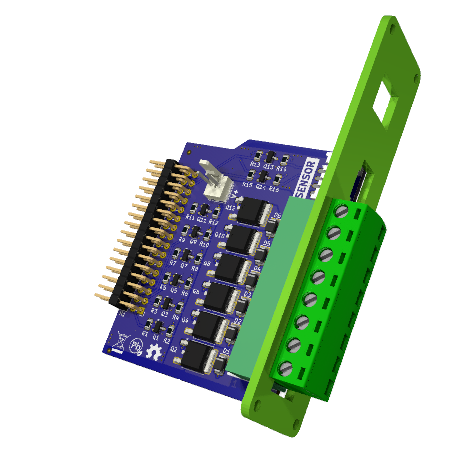
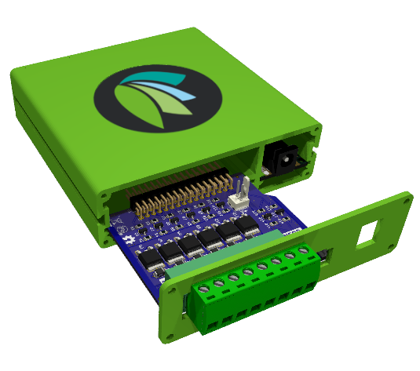

The **Sense'n'Drive Hardware Cartridge** provides the [controller](https://github.com/Edgeberry) with the capability for connecting to sensors and driving actuators.

**Features**
- **6 digital outputs** for driving actuators directly or with interposing relays, with internal or external power source.
- **An I²C port** level-shifted to 5V for reliably connecting to the [Freya "Terra" Sensor](https://github.com/Freya-Vivariums/Freya-Terra-Sensor)

<br clear="right"/>

## Usage



The Sense'n'Drive Hardware Cartridge is positioned in the expansion slot on the back side of the controller. The Raspberry Pi's I²C bus is levelshifted to 5V enabling compatibility with a wide range of peripheral components. The bus is routed to a 4P-2.0mm D90 connector for connecting with the [Freya "Terra" Sensor](https://github.com/Freya-Vivariums/Freya-Terra-Sensor) or a wide range of breakout boards from different ecosystems.

The digital outputs are P-channel MOSFETs configured for sourcing. An external power source can be applied to drive the digital outputs, or the controller's power source can be used by internally wiring the dedicated connectors.

<br clear="left"/>

### I²C sensor port
The I²C port is level-shifted to 5V, and connected to the JST 4P connector in the following way;
|  Pin   | Function |
|--------|----------|
| 1      | SCL      |
| 2      | SDA      |
| 3      | +5V      |
| 4      | GND      |

On Raspberry Pi, enable the I²C port using `raspi-config`:
```
$ sudo raspi-config
> 3     Interface options
> I5    I2C
> Enable
```
Now you can use the I²C interface `/dev/i2c-1` for connecting peripheral components.

### Digital Outputs
The digital outputs are P-channel MOSFETs configured for **sourcing**, and are connected as following:
|  GPIO  | OUTPUT |
|--------|--------|
| GPIO21 | D1     |
| GPIO20 | D2     |
| GPIO16 | D3     |
| GPIO13 | D4     |
| GPIO12 | D5     |
| GPIO18 | D6     |

Controling the digital outputs can be done from the commandline using `pinctrl`.
```
pinctrl set 21 op dh
```
**'op' meaning 'output', 'dh' digital high, 'dl' digital low.*

## License & Collaboration
**Copyright© 2024-2026 Sanne 'SpuQ' Santens**. The hardware and enclosure are released under the [**CERN OHL-W**](Hardware/LICENSE.txt) license. The software is released under the [**GNU GPL-3.0**](Software/LICENSE.txt) license. Trademark rules apply to the [Freya™ brand](https://github.com/Freya-Vivariums/.github/blob/main/brand/Freya_Trademark_Rules_and_Guidelines.md) and the [Edgeberry™ brand](https://github.com/Edgeberry/.github/blob/main/brand/Edgeberry_Trademark_Rules_and_Guidelines.md).

### Collaboration

If you'd like to contribute to this project, please follow these guidelines:
1. Fork the repository and create your branch from `main`.
2. Make your changes and ensure they adhere to the project's design style and conventions.
3. Test your changes thoroughly.
4. Ensure your commits are descriptive and well-documented.
5. Open a pull request, describing the changes you've made and the problem or feature they address.
